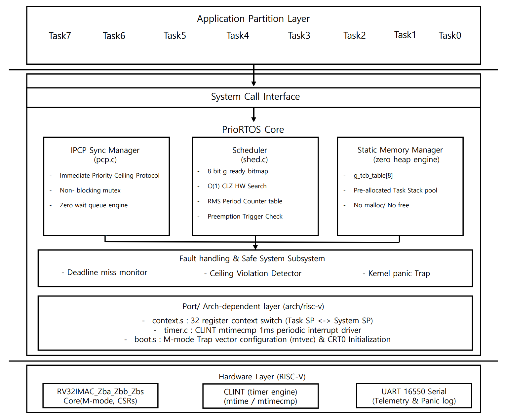

---

# PrioRTOS Architecture Specification

> **Deterministic, Single-Cycle Bitmap-Scheduled Hard RTOS for Mission-Critical RISC-V Systems**
> *Targeted for Flight Control Systems & Missile Actuators under Strict Determinism and IPCP Guarantee.*


---

# 프로젝트 문서

- [요구사항 초안](docs/requirements.md): 목표 범위, 요구사항 ID, 검증 기준 및 현재 구현 기준선
- [설계 결정 기록](docs/design-decisions.md): 확정이 필요한 플랫폼·시간·IPCP·오류 정책

문서에 `제안` 또는 `미결정`으로 표시된 내용은 합의 전까지 확정된 제품 요구사항이 아닙니다. 아래 아키텍처 설명의 목표/예시와 현재 구현 상태도 구분해서 확인하세요.

## 1. 시스템 엔지니어링 목표 (Engineering Objectives)

본 커널은 항공·방산 임베디드 제어기(Flight Control System, Missile Actuator System) 탑재를 전제로 하며, 다음 5대 공학적 목표를 최상위 불변식(Top-Level Invariants)으로 설정합니다. FreeRTOS의 한계를 개선하여 IPCP, RMS, 제로 레이턴시 디스패칭을 탑재한 Hard RTOS 마이크로커널을 지향합니다.

* **`OBJ-01` Strict Mathematical Determinism & Bounded WCET**
커널 내부의 모든 핵심 알고리즘(태스크 디스패치, 동기화 획득/반환, 틱 처리)은 $O(1)$의 고정 복잡도를 가지며, 루프와 재귀를 배제하여 스케줄러 실행 경로와 인터럽트 지연 시간(Interrupt Latency)이 수학적으로 유계(Strictly Bounded)됩니다.
* **`OBJ-02` Elimination of Dynamic Failure Modes**
동적 힙 할당, 가변 길이 링크드 리스트, 런타임 태스크 생성/삭제를 아키텍처 레벨에서 배제하여 컴파일 타임에 전체 시스템의 메모리 레이아웃을 확정하고 힙 단편화 및 OOM(Out of Memory) 실패 모드를 원천 제거합니다.
* **`OBJ-03` Single Worst-Case Blocking Bound via IPCP**
Immediate Priority Ceiling Protocol(IPCP)을 적용하여 임의의 태스크가 겪을 수 있는 최악 차단 시간($B_i$)을 단 1회의 최대 임계 구역($\max B_k$)으로 한정하며, 연쇄 차단(Chained Blocking) 및 상호 교착 상태(Deadlock)의 부재를 이론적으로 보장합니다.
* **`OBJ-04` Design for High Verifiability & Bounded Formal Checking**
* **결정론적 단일 제어 흐름:** 복잡한 중첩 삼항 연산자와 매크로 분기를 배제하고, 핵심 디스패치 루틴(`sched_select_next`)을 루프 없는 단일 분기($$O(1)$$)로 설계하여 제어 흐름 분석(CFG) 및 커버리지 테스팅이 용이한 구조를 유지합니다.
* **CBMC 기반 핵심 불변식 검증:** 포화 모델 체킹 대신 SAT 기반 유계 모델 체커(CBMC)를 적용하여 `mutex.c`의 IPCP 자원 획득 시 우선순위 상한 불변식($P_{active} \le Ceiling$)과 동기화 무결성을 정형적으로 검증(Bounded Model Checking)합니다.
* **단위 검증 목표:** `gcov` 기준 핵심 스케줄링 및 동기화 모듈에 대해 95% 이상의 구문(Statement) 및 분기(Branch) 커버리지를 검증합니다.


* **`OBJ-05` Deterministic Fault Containment & Safe-State Transition**
런타임 결함(Ceiling 위반, 유효하지 않은 시스템 콜, 스택 경계 침범) 발생 시 추가적인 상태 오염을 방지하기 위해 즉각 `kernel_panic()`을 호출하며, 전역 인터럽트 차단 및 하드웨어 WFI 저전력 루프 진입을 통해 원자적으로 사전 정의된 안전 정지 모드(Fail-Safe / Safe-Halt State)로 전이합니다.

---

## 2. 시스템 아키텍처 구조 (System Architecture Structure)

### 2.1 계층형 제어 및 권한 전이 구조 (Privilege & Control Flow)



CPU 주도권은 RISC-V M-Mode(Machine Mode) 권한 하에서 하드웨어 인터럽트, 커널 스케줄러, 애플리케이션 태스크 3개 계층 간에 결정론적으로 전이됩니다.

```text
+-------------------------------------------------------------------------+
| [계층 1] 하드웨어 인터럽트 계층 (CLINT Timer / External ISR)            |
|  - 실행 권한: M-Mode, 전역 인터럽트 활성화 상태에서 최상위 선점권       |
|  - 스택 사용: 전용 시스템 인터럽트 스택 (g_system_stack)                |
|  - 진입/복귀: trap_entry -> ISR -> trap_exit (mret)                     |
+-------------------------------------------------------------------------+
                               │
            선점 발생 시       │ 타이머 틱(wait_next_period 해제 감지)
            문맥 스위칭 요청   ▼
+-------------------------------------------------------------------------+
| [계층 2] 커널 스케줄러 코어 (SafeMicroRTOS Core)                         |
|  - 모듈 구성: O(1) Bit-Search Dispatcher (sched.c)                      |
|              IPCP Resource Manager (mutex.c)                            |
|  - 실행 특성: Zero-Wait-Queue, 비차단 동기화, O(1) CLZ 비트 연산       |
|  - 제어권 이동: context.S (32개 레지스터 하드웨어 백업/복원)            |
+-------------------------------------------------------------------------+
                               ▲
            시스템 콜 트랩     │ 디스패치 복귀 (mret)
            (ipcp_lock 등)     │
+-------------------------------------------------------------------------+
| [계층 3] 정적 파티션 태스크 계층 (Static Application Tasks)             |
|  - Task 7 (Priority 7, Period 10ms)  : 최고 우선순위 비행 제어 루프     |
|  - Task 6..1                         : 중위/하위 센서 수집 및 통신 루프 |
|  - Task 0 (Priority 0, Period Inf)   : 유휴 태스크 (Idle Task, wfi 루프)|
+-------------------------------------------------------------------------+

```

---

## 3. 커널 특성 비교 분석 (Kernel Comparison Matrix)

| 비교 항목 | FreeRTOS | μC/OS-II | OSEK/VDX (BCC1) | **PrioRTOS (본 설계)** |
| --- | --- | --- | --- | --- |
| **우선순위-태스크 관계** | 다대다 ($M:N$) | 1대1 ($1:1$) | 1대1 ($1:1$) | **1대1 ($1:1$)** |
| **동일 우선순위 RR** | 지원 (비결정적 지터) | 금지 | 금지 | **원천 금지 (Zero-Jitter)** |
| **스케줄러 구조** | 우선순위별 이중 리스트 | 64비트 비트맵 룩업 | 비트맵 $O(1)$ CLZ | **8비트 단일 레지스터 $O(1)$ CLZ** |
| **동기화 프로토콜** | 우선순위 상속 (PIP) | 뮤텍스 / 세마포어 | IPCP (Ceiling) | **IPCP (Ceiling)** |
| **대기 큐 구조** | 블로킹 연결 리스트 | 블로킹 큐 | 큐 불필요 | **원천 배제 (포인터 0개 구조체)** |
| **메모리 할당** | 동적 힙 지원 | 정적 / 동적 혼용 | 100% 정적 고정 | **100% 컴파일 타임 정적 고정** |

---

## 4. 프로젝트 디렉터리 구조 (Directory Layout)

```text
prio_rtos/
├── Makefile                          # 통합 빌드 (build, run, test, cbmc, coverage, trace)
├── linker.ld                         # 정적 메모리 배치 (RAM 128M / BSS 고정 파티셔닝)
│
├── boot/                             # [하드웨어 시동부]
│   └── startup.S                     # SP 초기화, BSS 제로클리어, Trap 벡터 등록, main 점프
│
├── kernel/                           # [마이크로커널 코어 (약 800라인 엄수)]
│   ├── include/                      
│   │   ├── prio_rtos.h               # [Public API] task_create, task_yield, mutex_lock/unlock
│   │   └── kernel_internal.h         # [Private Core] TCB_t, ready_bitmap, CLZ 매크로, LLR 매핑 태그
│   ├── context.S                     # 문맥 교환 어셈블리 (Caller/Callee 레지스터 보존, SP 전환)
│   ├── sched.c                       # O(1) 결정론적 스케줄러 (__builtin_clz 비트맵 탐색)
│   ├── mutex.c                       # IPCP (Immediate Priority Ceiling Protocol) 자원 락
│   └── trap.c                        # RISC-V M-mode 타이머 인터럽트(CLINT) 및 시스템 콜 디스패처
│
├── bsp/                              # [보드 지원 패키지]
│   ├── uart.c                        # QEMU 16550 UART 드라이버 (MMIO 레지스터 다이렉트 R/W)
│   ├── uart.h                        # UART MMIO 베이스(0x10000000) 및 레지스터 오프셋 정의
│   ├── clint.c                       # Core Local Interruptor 타이머 설정 (0x02000000)
│   └── clint.h                       # mtime, mtimecmp 하드웨어 주소 정의
│
├── app/                              # [사용자 도메인 애플리케이션]
│   ├── tasks.c                       # Flight Control 태스크 3종 (Nav, IMU Sensor, Actuator Motor)
│   ├── tasks.h                       
│   └── main.c                        # 하드웨어 초기화 -> 태스크 등록 -> rtos_start() 런치
│
├── verification/                     # [DO-178C / DO-333 DAL-A 검증 핵심 자산]
│   ├── cbmc/                         # [DO-333 정형 기법: Bounded Model Checker]
│   │   ├── run_cbmc.sh               # CBMC 자동 실행 및 반례(Counterexample) 검출 래퍼
│   │   ├── harness_sched_bound.c     # 스케줄러 배열/비트맵 오버플로우 불가 수학적 증명
│   │   ├── harness_ipcp_deadlock.c   # IPCP 자원 점유 시 상호 배제 및 데드락 불가 정형 증명
│   │   └── harness_null_pointer.c    # 모든 TCB 포인터 역참조 안전성(Safety) 증명
│   ├── coverage/                     # [DO-178C Structural Coverage: MC/DC 분석]
│   │   ├── run_coverage.sh           # gcov/lcov 연동 호스트 기반 단위 테스트 실행기
│   │   ├── test_sched_mcdc.c         # O(1) 비트맵 조건문 분기 MC/DC 100% 충족 하네스
│   │   ├── test_mutex_mcdc.c         # IPCP 우선순위 상승/복구 분기 조건 커버리지 하네스
│   │   └── mcdc_report.html          # 최종 생성되는 분기 커버리지 리포트
│   └── traceability/                 # [DO-178C 양방향 추적성 매트릭스 (Traceability)]
│       ├── srs_requirements.md       # 상위 요구사항(HLR: High-Level Requirements)
│       ├── llr_requirements.md       # 하위 요구사항(LLR: Low-Level Requirements)
│       ├── trace_matrix.csv          # HLR <-> LLR <-> Source Code <-> Test Case 1:1 매핑표
│       └── check_traceability.py     # 소스 코드 주석 태그를 파싱해 Dead Code 검출하는 자동화 툴
│
├── benchmark/                        # [결정론 및 지터(Jitter) 정량 평가]
│   ├── jitter_test.c                 # mcycle CSR 레지스터 기반 1,000,000회 문맥 교환 지터 계측
│   ├── plot_jitter.py                # FreeRTOS vs PrioRTOS 레이턴시 분포도 산포도 플롯 스크립트
│   └── run_benchmark.sh              # QEMU 백그라운드 벤치마크 및 raw 데이터 추출기
│
├── docs/                             # [포트폴리오 제출용 증적 보고서]
│   ├── dal_a_compliance_report.pdf  # DO-178C DAL-A 충족 전략서 (PSAC 축약본)
│   └── formal_verification_proof.md  # CBMC 수학적 증명 완료 로그 정리본
│
└── build/                            # [격리 빌드 디렉터리 (Git 추적 제외)]
    ├── obj/                          # *.o, *.d 의존성 중간 파일
    ├── kernel.elf                    # 최종 링킹 바이너리
    ├── kernel.map                    # 정적 심볼 주소 배치도 (VMA/LMA 정밀 감사용)
    └── kernel.asm                    # 전체 디스어셈블 덤프 파일

```