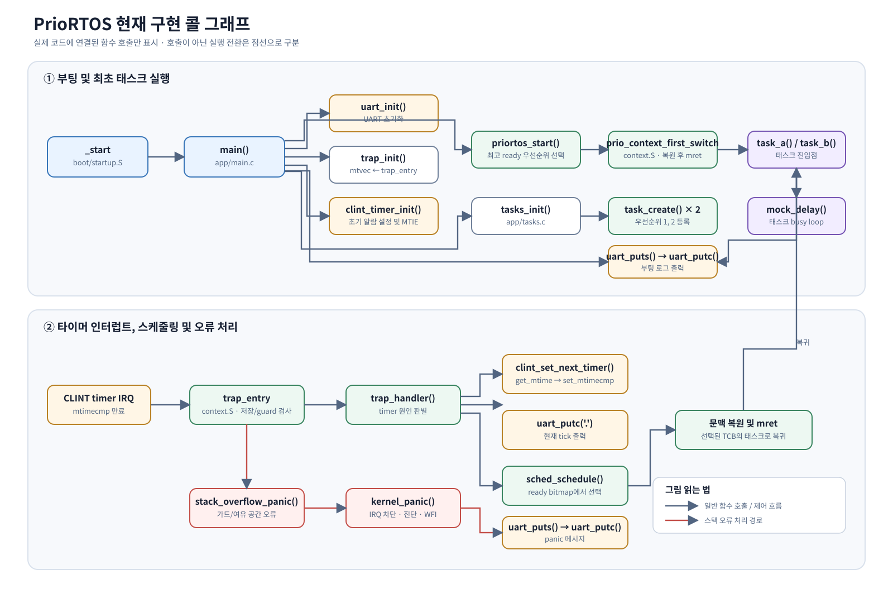

# PrioRTOS 구현 지도

이 문서는 현재 저장소의 파일 구성과 함수 호출 흐름을 기준으로 다음 구현 순서를 판단하기 위한 지도다.
`현재 구현`은 코드가 존재한다는 뜻이며, 테스트나 정형 검증이 끝났다는 뜻은 아니다.
`미구현` 경로는 목표 아키텍처를 설명하기 위해 표시한 것이며 실제 코드 호출 그래프가 아니다.

## 상태 표기

- `[구현]`: 함수 또는 경로가 소스에 있음
- `[부분]`: 골격은 있으나 동작/오류 처리/검증이 부족함
- `[선언만]`: 헤더에 선언됐지만 구현을 찾지 못함
- `[미구현]`: 현재 동작 경로가 없음

## 현재 파일 트리와 함수

```text
PrioRTOS/
├── Makefile
│   ├── all                  -> kernel.elf, kernel.asm 빌드
│   ├── run                  -> QEMU 실행
│   ├── cbmc                 -> verification/cbmc/run_cbmc.sh 실행 시도
│   └── trace                -> verification/traceability 검사 시도
├── boot/
│   └── startup.S
│       └── _start           [구현] 스택 설정 -> BSS 초기화 -> main()
├── app/
│   ├── main.c
│   │   └── main()
│   │       ├── uart_init()
│   │       ├── uart_puts()
│   │       ├── trap_init()
│   │       ├── clint_timer_init()
│   │       ├── tasks_init()
│   │       └── priortos_start()
│   ├── tasks.c
│   │   ├── tasks_init()
│   │   │   └── task_create() x 2
│   │   ├── task_a()         태스크 진입점; uart_putc(), mock_delay()
│   │   ├── task_b()         태스크 진입점; uart_putc(), mock_delay()
│   │   └── mock_delay()     테스트용 busy loop
│   └── tasks.h              tasks_init() 선언
├── bsp/
│   ├── clint.c
│   │   ├── clint_timer_init()
│   │   │   ├── clint_get_mtime()
│   │   │   └── clint_set_mtimecmp()
│   │   ├── clint_set_next_timer()
│   │   │   ├── clint_get_mtime()
│   │   │   └── clint_set_mtimecmp()
│   │   ├── clint_get_mtime()
│   │   └── clint_set_mtimecmp()
│   ├── clint.h               CLINT MMIO 정의 및 타이머 API
│   ├── uart.c
│   │   ├── uart_init()
│   │   ├── uart_putc()
│   │   └── uart_puts()       -> uart_putc()
│   └── uart.h                UART API
├── kernel/
│   ├── include/
│   │   ├── prio_rtos.h       공개 API; mutex 함수는 선언만 있음
│   │   ├── kernel_internal.h TCB, 상태, ready bitmap, 내부 선언
│   │   └── stack_guard.h     가드/트랩 프레임 상수
│   ├── sched.c
│   │   ├── task_create()     TCB/초기 문맥/guard 생성, ready bit 설정
│   │   ├── priortos_start()  최고 ready 우선순위 선택 -> 최초 문맥 전환
│   │   ├── sched_schedule()  최고 ready 우선순위 선택 및 현재 TCB 갱신
│   │   ├── stack_overflow_panic() -> kernel_panic()
│   │   └── task_exit_trap()  태스크 함수가 반환할 경우 WFI 루프
│   ├── trap.c
│   │   ├── trap_init()       mtvec에 trap_entry 등록
│   │   └── trap_handler()    timer interrupt -> timer 재설정 -> sched_schedule()
│   ├── context.S
│   │   ├── prio_context_first_switch  최초 TCB 문맥 복원 -> mret
│   │   └── trap_entry                 프레임 저장/가드 검사/핸들러/복원
│   ├── panic.c
│   │   └── kernel_panic()    인터럽트 차단 -> UART 진단 -> WFI
│   └── mutex.c               비어 있음; mutex API 구현 없음
├── docs/
│   ├── requirements.md       요구사항 및 상태 기준
│   ├── design-decisions.md   미결정 설계 선택
│   └── implementation-map.md 이 파일
└── linker.ld                 메모리 배치와 시스템 스택 심볼
```

## 현재 코드의 호출 그래프

아래 그림은 실제 코드에 연결된 콜 그래프다. 일반 실선은 함수 호출/제어 흐름, 빨간 선은 스택 오류 처리 경로를 나타낸다. 태스크 진입은 최초 문맥 복원 후 `mret`로 이루어진다.



### 부팅 및 최초 태스크 실행

```text
_start [구현]
└── main [구현]
    ├── uart_init [구현]
    ├── uart_puts [구현]
    │   └── uart_putc [구현]
    ├── trap_init [구현]
    ├── clint_timer_init [구현]
    │   ├── clint_get_mtime [구현]
    │   └── clint_set_mtimecmp [구현]
    ├── tasks_init [구현]
    │   ├── task_create(prio=1) [구현]
    │   └── task_create(prio=2) [구현]
    └── priortos_start [구현]
        ├── ready bitmap에서 최고 우선순위 선택
        └── prio_context_first_switch [context.S]
            └── 선택 태스크 진입점: task_a 또는 task_b
```

### 타이머 인터럽트 및 문맥 전환

```text
하드웨어 timer interrupt
└── trap_entry [context.S]
    ├── 스택 여유 공간 검사
    ├── 전체 태스크 문맥 저장
    ├── stack canary 검사
    ├── 현재 TCB의 sp 갱신
    ├── trap_handler [구현]
    │   ├── mcause가 timer interrupt이면
    │   │   ├── clint_set_next_timer [구현]
    │   │   │   ├── clint_get_mtime
    │   │   │   └── clint_set_mtimecmp
    │   │   ├── uart_putc('.')
    │   │   └── sched_schedule [구현]
    │   └── 그 외 원인은 WFI 루프 [부분: panic/error 경로와 미연결]
    ├── 선택된 TCB의 sp로 전환 및 문맥 복원
    └── mret -> 선택 태스크로 복귀
```

### 오류 경로

```text
trap_entry stack guard/headroom 실패
└── stack_overflow_panic
    └── kernel_panic
        ├── 전역 인터럽트 비활성화
        ├── uart_puts -> uart_putc
        └── WFI 루프

태스크 함수 반환
└── task_exit_trap
    └── WFI 루프
```

## 현재 구현 경계와 연결되지 않은 경로

```text
mutex_lock() / mutex_unlock() [선언만]
└── mutex.c [비어 있음]

task_yield() [선언만]
└── trap 또는 sched_schedule로 연결되지 않음

TASK_STATE_BLOCKED
└── 상태 상수만 있음; block/wakeup API와 ready bit 제거·복구 흐름 없음

idle task (priority 0)
└── 정책 문서에는 있으나 등록/실행 코드 없음

CBMC 검증 및 추적성 검사
└── Makefile 타깃은 있으나 verification 하위 파일은 현재 트리에 없음
```

## 다음 구현 순서 제안

IPCP부터 작성하기보다 태스크 상태와 스케줄러의 기반 불변식을 먼저 닫는 순서가 안전하다.
뮤텍스 대기/해제를 정확히 구현하려면 READY/BLOCKED 전이와 문맥 전환의 계약이 먼저 정해져야 한다.

| 순서 | 다음 작업 | 구현 범위 | 완료 기준 |
|---|---|---|---|
| 1 | 스케줄러 상태 불변식과 idle 동작 | 슬롯 0의 idle 태스크 정책, `UNUSED/READY/RUNNING/BLOCKED` 전이, ready bitmap 갱신을 하나의 일관된 계약으로 정리한다. `sched_schedule()`의 빈 ready set 처리도 idle 정책과 맞춘다. | idle만 남는 경우와 우선순위 전환에서 현재 TCB, 상태, bitmap이 항상 일치한다. |
| 2 | `task_yield` 및 block/wakeup 경로 | 선언된 `task_yield()`를 구현하고, block/unblock 시 READY 상태와 bitmap을 원자적으로 갱신한다. 타이머 대기를 추가한다면 timebase/tick 단위를 먼저 결정한다. | 두 개 이상의 태스크가 양보/대기/깨우기 후 정확한 상태로 전환되고, 불법 전이는 명시적으로 거부된다. |
| 3 | 스케줄러 단위 테스트와 트랩 통합 테스트 | 최고 우선순위 선택, 동률 정책, 비트 설정/해제, 초기 디스패치, 반복 선점 테스트를 작성한다. | 요구사항의 scheduler/trap 케이스가 자동화되어 통과한다. |
| 4 | IPCP 정책 결정 후 mutex 구현 | ceiling 산정, 중첩 규칙, 비소유자 해제, 재귀 획득, 즉시 불가할 때 block/error 동작을 결정하고 API/상태를 구현한다. | 정상/오류/경계 사례 테스트 및 ceiling/소유권 불변식 검증이 통과한다. |
| 5 | CBMC 및 시간 측정 | 검증 하네스를 먼저 작성하고, 실제 툴체인/ISA에서 생성 코드와 타이머 주기를 확인한다. 이후 대상 기반 WCET/지연 측정을 수행한다. | 검증 범위와 가정, 측정 환경, 결과가 재현 가능하게 기록된다. |

### 권장 바로 다음 작업

**1번: 스케줄러 상태 불변식과 idle 동작**부터 시작하는 것을 권한다. 먼저 다음 규칙을 요구사항으로 고정한 뒤 구현하면 된다.

1. `g_ready_bitmap`의 각 비트가 어떤 태스크 상태를 의미하는지 명확히 한다.
2. BLOCKED/UNUSED 태스크는 ready bitmap에서 제외하고, READY/RUNNING의 포함 여부를 하나로 정한다.
3. idle은 다른 태스크가 없을 때만 선택되는지, 항상 ready 후보로 두는지 결정한다.
4. 우선순위 0을 idle 전용으로 강제할지 정한다.
5. 모든 상태 전이를 한 API 경로에서 갱신하고 단위 테스트한다.

이 규칙이 확정되면 block/wakeup과 IPCP가 같은 상태 관리 경로를 재사용할 수 있어 이후 변경이 작아진다.

## 확인 시 주의할 점

- `g_ready_bitmap`의 C 타입은 32비트이며 현재 사용하는 우선순위 범위는 0–7이다. 고정 시간 선택 및 CLZ 성능은 생성 코드와 타깃에서 검증되기 전까지 보장되지 않는다.
- `sched_schedule()`은 ready bitmap에서 최고 우선순위를 고르지만 현재 코드에서 task block/wakeup에 따른 bit 제거/복원이 연결되어 있지 않다.
- `TIMER_INTERVAL`은 10 MHz 기준 10,000,000 tick으로 설정돼 있어 1초에 해당한다. 1 ms tick으로 사용하려는 의도라면 timebase와 함께 재결정해야 한다.
- 트랩의 system stack과 `mscratch` 접근 경로가 코드에 있지만, 반복 선점·가드 손상·레지스터 보존 테스트를 통과하기 전에는 보호 기능 검증 완료로 보지 않는다.
- Makefile 타깃 이름이 존재하는 것만으로 CBMC/trace 실행 파일이나 검증 결과가 존재한다고 판단하지 않는다.
